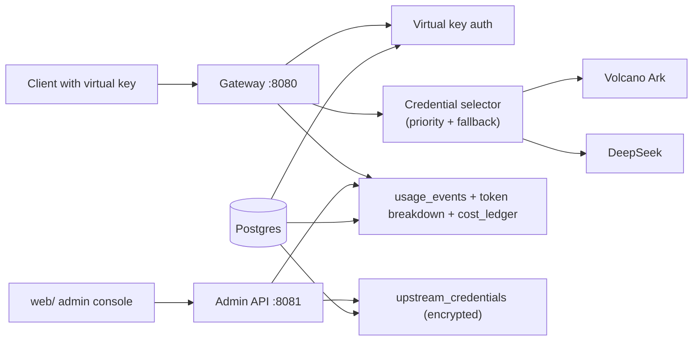

# OmniToken

Language: English | [简体中文](README.zh-CN.md)

OmniToken is a self-hosted AI access gateway for internal platform teams. It
issues virtual API keys, proxies OpenAI-compatible requests to upstream model
providers, records token usage and cost, and gives administrators a control
plane for users, keys, models, providers, and budgets.

OmniToken is not an aggregate model marketplace. It is an access-control and
cost ledger layer for companies that need to know who used which model, through
which key, under which policy, at what cost — without leaking provider keys or
prompt bodies.

## Quick Deploy (Compose)

1. `cd deploy && cp .env.example .env`
2. Fill `OMNITOKEN_MASTER_KEY`, one upstream key, and `ADMIN_INITIAL_PASSWORD`.
3. Optional: set `DOMAIN`, `SSL_CERT_PATH`, and `SSL_KEY_PATH`.
4. `docker compose -f docker-compose.prod.yml up -d`
5. Open `http://localhost/admin` or `https://<DOMAIN>/admin`.
6. Sign in as `admin@democorp.local`, then create users and keys in the web UI.

## Why OmniToken

| Market pattern | Examples | Strong at | OmniToken differentiation |
| --- | --- | --- | --- |
| Broad model proxy | [LiteLLM](https://docs.litellm.ai/docs/proxy_server), [New API](https://github.com/QuantumNous/new-api) | Many providers, OpenAI-compatible routing, virtual keys, budgets, retries | Pairs provider breadth with a stricter enterprise ledger: user/project/key attribution, provider-specific token breakdowns, audit-ready cost records. |
| Hosted developer gateway | [Vercel AI Gateway](https://vercel.com/docs/ai-gateway), [Cloudflare AI Gateway](https://developers.cloudflare.com/ai-gateway/) | Fast hosted onboarding, observability, caching, simple base URL migration | Self-hosted by default; designed for internal security boundaries, private cost centers, and controllable data retention. |
| API gateway plugin suite | [Kong AI Gateway](https://docs.konghq.com/gateway/latest/get-started/ai-gateway/), [Envoy AI Gateway](https://aigateway.envoyproxy.io/) | Traffic management, plugins, Kubernetes-native operations | AI-governance-first product surface: virtual key policy, cost accounting, admin workflows are first-class, not plugins. |
| LLM observability | [Helicone](https://docs.helicone.ai/getting-started/integration-method/gateway), [TensorZero](https://www.tensorzero.com/docs/gateway) | Request logs, traces, prompts, experiments | Cost- and security-oriented observability. Prompt capture is not the default; accounting, redaction, and auditability come before experimentation. |

## Features

**Multi-provider key pool**
- Manages credentials for Volcano Ark and DeepSeek under one gateway, with
  AES-256-GCM envelope encryption at rest.
- Priority-ordered selection with weighted round-robin within a priority tier;
  429/degraded triggers cross-provider fallback.
- Usage is attributed to the actual provider + credential that served each
  request.

**Virtual model routing**
- Clients call stable aliases (`chat-fast`, `chat-balanced`, `chat-quality`,
  `chat-code`, `chat-experimental`); the gateway rewrites them to real
  provider model strings.

**RBAC and quotas**
- Three roles: admin / member / viewer, enforced by a hard-coded policy matrix.
- Per-user `monthly_token_budget_limit`, checked before usage is recorded;
  over-budget requests return a 402 quota envelope.
- Admins edit user quotas through the web console.

**Virtual API keys**
- `omt_`-prefixed keys issued by the admin service. Plaintext is returned once
  on creation; the database stores only `key_prefix` and bcrypt hash.

**Audit and safety**
- All admin write operations (`login`, `create_virtual_key`, `update_quota`,
  `create_credential`, `disable_credential`, …) land in `audit_logs` with
  before/after snapshots.
- Per-key RPM anomaly warning over a 5-minute window (default 60 RPM).
- Logs never print provider keys, virtual keys, prompt bodies, or
  Authorization headers; streaming responses use a unified error envelope.

**Operations**
- Admin web console with an **Upstream Credentials** tab — add or disable
  provider credentials without SSH or `.env` edits.
- Gateway polls the database every 30 seconds (configurable) and atomically
  swaps in new credentials, so adds take effect without restart.
- OpenAI-compatible entry point: `POST /v1/chat/completions` and
  `GET /v1/models` work with existing OpenAI SDKs.
- One-command Docker Compose stack: gateway + admin + Postgres + Redis + NATS,
  with migrations and seed applied automatically.

## Architecture



## Prerequisites

- Docker (Compose v2)
- A 32-byte master key encoded as 64 hex characters (used for envelope
  encryption of upstream credentials)
- At least one upstream provider key (Volcano Ark coding plan key or DeepSeek
  API key)
- Optional, for local development: Go 1.23+, Python 3, `curl`, `make`

## Deployment

### 1. Generate the master key

```bash
openssl rand -hex 32 > .omnitoken-master-key
```

Bash / Linux / macOS:

```bash
chmod 600 .omnitoken-master-key
export OMNITOKEN_MASTER_KEY_FILE="$(pwd)/.omnitoken-master-key"
```

PowerShell:

```powershell
$env:OMNITOKEN_MASTER_KEY_FILE = "$PWD\.omnitoken-master-key"
```

Use the same key for the gateway and admin processes; rotating it requires
re-encrypting all stored credentials (see
[`docs/operations/master-key-rotation.md`](docs/operations/master-key-rotation.md)).

### 2. Create `.env`

```bash
cp .env.example .env
```

PowerShell:

```powershell
Copy-Item .env.example .env
```

Fill in at minimum:

```dotenv
OMNITOKEN_MASTER_KEY_FILE=/absolute/path/to/.omnitoken-master-key
OMNITOKEN_ADMIN_SESSION_TTL=24h
OMNITOKEN_ADMIN_CORS_ORIGINS=http://localhost:3000

# Provide at least one provider. Both can coexist.
OMNITOKEN_ARK_API_KEY=<your-volcano-ark-key>
OMNITOKEN_DEEPSEEK_KEYS_1=<your-deepseek-key>
```

`.env` is gitignored. Leave `OMNITOKEN_ADMIN_BOOTSTRAP_TOKEN` empty — admin
login goes through the session endpoint.

### 3. Start the stack

```bash
make up
```

Windows fallback:

```powershell
.\scripts\dev.ps1 up
```

This builds the gateway/admin/migrate images, starts Postgres/Redis/NATS, runs
database migrations, seeds the demo organization and roles, seeds the upstream
credentials from `.env`, and exposes:

| Service | URL |
| --- | --- |
| Gateway | `http://localhost:8080` |
| Admin API | `http://localhost:8081` |
| Postgres | `localhost:15432` |
| Redis | `localhost:16379` |
| NATS | `localhost:14222` |

Health checks:

```bash
curl http://localhost:8080/healthz
curl http://localhost:8081/healthz
```

### 4. Open the web console

```bash
cd web && python -m http.server 3000
```

Then open:

```text
http://localhost:3000/?admin=http://localhost:8081
```

Sign in with one of the seeded accounts:

| Role | Email | Password |
| --- | --- | --- |
| Admin | `admin@democorp.local` | `password` |
| Viewer | `user01@democorp.local` | `password` |

The console has five views:

- **Overview** — monthly tokens, estimated cost, active users, trend, model share.
- **Users** — per-user token usage and monthly budget editing (admin only).
- **Models** — prompt/completion split, cost, call count.
- **Virtual Models** — virtual aliases and their real provider model mappings.
- **Upstream Credentials** — add or disable provider credentials (admin only).
- **Audit** — admin login and write-operation trail.

## Usage

### Issue a virtual key

PowerShell:

```powershell
$Login = Invoke-RestMethod `
  -Method Post `
  -Uri "http://localhost:8081/api/admin/login" `
  -ContentType "application/json" `
  -Body (@{ email = "admin@democorp.local"; password = "password" } | ConvertTo-Json)
$AdminToken = $Login.token

$Key = Invoke-RestMethod `
  -Method Post `
  -Uri "http://localhost:8081/api/admin/dev/virtual-keys" `
  -Headers @{ Authorization = "Bearer $AdminToken" } `
  -ContentType "application/json" `
  -Body (@{
    organization_id = "00000000-0000-0000-0000-000000000001"
    user_id = "00000000-0000-0000-0000-000000000201"
  } | ConvertTo-Json)
$VirtualKey = $Key.virtual_key
```

Bash:

```bash
ADMIN_TOKEN=$(curl -sS -X POST http://localhost:8081/api/admin/login \
  -H "Content-Type: application/json" \
  -d '{"email":"admin@democorp.local","password":"password"}' | jq -r .token)

VIRTUAL_KEY=$(curl -sS -X POST http://localhost:8081/api/admin/dev/virtual-keys \
  -H "Authorization: Bearer ${ADMIN_TOKEN}" \
  -H "Content-Type: application/json" \
  -d '{"organization_id":"00000000-0000-0000-0000-000000000001","user_id":"00000000-0000-0000-0000-000000000201"}' \
  | jq -r .virtual_key)
```

The plaintext key (prefixed `omt_`) is only returned once. Copy it immediately.

### Call the gateway

List models:

```bash
curl http://localhost:8080/v1/models -H "Authorization: Bearer $VIRTUAL_KEY"
```

Non-streaming chat completion:

```bash
curl -X POST http://localhost:8080/v1/chat/completions \
  -H "Authorization: Bearer $VIRTUAL_KEY" \
  -H "Content-Type: application/json" \
  -d '{"model":"chat-fast","messages":[{"role":"user","content":"Output exactly: pong"}],"stream":false,"max_tokens":32}'
```

Streaming SSE:

```bash
curl --no-buffer -X POST http://localhost:8080/v1/chat/completions \
  -H "Authorization: Bearer $VIRTUAL_KEY" \
  -H "Content-Type: application/json" \
  -d '{"model":"chat-fast","messages":[{"role":"user","content":"Count 1 to 5."}],"stream":true,"max_tokens":64}'
```

The gateway keeps the virtual key local, resolves the alias, injects the real
provider credential upstream, and records usage after the response completes.

### Add upstream credentials at runtime

In the web console, open **Upstream Credentials → Add credential**, choose the
provider (Ark or DeepSeek), paste the key, set priority and weight, and save.
The gateway picks the new credential up within `OMNITOKEN_CREDENTIAL_POLL_INTERVAL`
(default 30 s); no restart needed.

## Common Commands

| Goal | Command |
| --- | --- |
| Start stack | `make up` |
| Stop stack | `make down` |
| Follow logs | `make logs` |
| Windows start | `.\scripts\dev.ps1 up` |
| Reset volumes | `docker compose --env-file .env -f deploy/docker-compose.yml down -v` |
| Go tests | `go test -count=1 ./...` |
| Race tests | `make test` |

## Troubleshooting

**Gateway returns `401 invalid_api_key`**
Use the full `virtual_key` returned by the admin API, not the `key_prefix`. The
plaintext key starts with `omt_`.

**Gateway cannot reach the upstream provider**
Verify the credential is listed and enabled in the **Upstream Credentials** tab.
If you added it via `.env`, confirm `OMNITOKEN_ARK_API_KEY` or
`OMNITOKEN_DEEPSEEK_KEYS_*` is set, then `make up` again.

**Web console shows a CORS error**
Serve the console from `http://localhost:3000`, or add your origin to
`OMNITOKEN_ADMIN_CORS_ORIGINS` and restart admin:

```dotenv
OMNITOKEN_ADMIN_CORS_ORIGINS=http://localhost:3000,http://127.0.0.1:3000
```

**Admin charts are empty**
Send at least one successful `/v1/chat/completions` request and wait a second
or two for usage recording, then reload the console.

**Start from a clean database**

```bash
docker compose --env-file .env -f deploy/docker-compose.yml down -v
make up
```

## Repository Layout

| Path | Purpose |
| --- | --- |
| `cmd/gateway` | OpenAI-compatible gateway |
| `cmd/admin` | Admin API and admin web backend |
| `cmd/migrate` | golang-migrate wrapper |
| `cmd/upstream-credential-seed` | Encrypt and seed credentials from `.env` |
| `internal/auth` | Virtual-key generation and auth middleware |
| `internal/proxy` | Chat-completions proxy and provider adapters |
| `internal/credentials` | Encrypted credential pool, polling reloader |
| `internal/usage` | Usage parsing, recording, cost ledger writes |
| `migrations` | Database schema migrations |
| `deploy` | Dockerfiles, Compose, seed SQL |
| `web` | Static admin console |
| `docs/operations` | Operations runbooks (master key rotation, …) |
| `docs/release` | Release notes |

## Security Notes

- Never commit `.env`, master keys, provider keys, virtual keys, or full
  Authorization headers.
- Pricing in `deploy/postgres/002_seed.sql` is placeholder data and must not be
  used for commercial quotes.
- The dev virtual-key endpoint is intended for admins issuing keys to internal
  users, not as a public signup API.
- Master key rotation procedure:
  [`docs/operations/master-key-rotation.md`](docs/operations/master-key-rotation.md).

## Release

- v1.0.0: [`docs/release/v1.0.0.md`](docs/release/v1.0.0.md)
