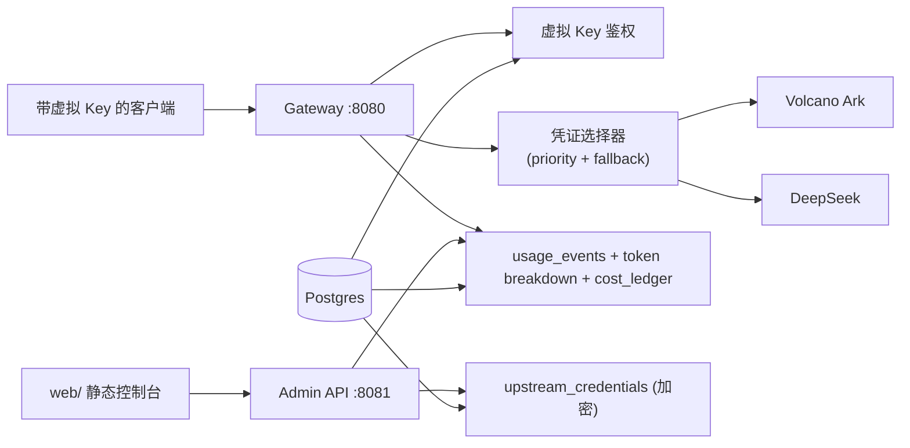

# OmniToken

语言：[English](README.md) | 简体中文

OmniToken 是面向企业内部平台团队的自托管 AI 访问网关。它签发虚拟 API Key、把
OpenAI 兼容请求转发到上游模型厂商、记录 token 用量与成本，并为管理员提供用户、
Key、模型、厂商与预算治理的控制面。

OmniToken 不是"模型最多的聚合市场"。它要做的是企业内部 AI 访问控制与成本账本层：
让公司能清楚知道谁、用哪个 Key、在什么策略下、调用了哪个模型、产生了多少成本，
同时不泄露真实厂商 Key、不默认记录 Prompt 全文。

## 为什么是 OmniToken

| 市场形态 | 代表产品 | 强项 | OmniToken 差异化 |
| --- | --- | --- | --- |
| 多模型代理 | [LiteLLM](https://docs.litellm.ai/docs/proxy_server), [New API](https://github.com/QuantumNous/new-api) | 多厂商、OpenAI 兼容路由、虚拟 Key、预算、重试 | 在多厂商覆盖之上叠一层更严格的企业账本：用户/项目/Key 归因、provider-specific token 拆分、可审计成本记录。 |
| 托管开发者网关 | [Vercel AI Gateway](https://vercel.com/docs/ai-gateway), [Cloudflare AI Gateway](https://developers.cloudflare.com/ai-gateway/) | 托管式上手、观测、缓存、迁移 base URL 简单 | 默认自托管，更适合企业内部安全边界、私有成本中心、可控数据保留策略。 |
| API Gateway 插件套件 | [Kong AI Gateway](https://docs.konghq.com/gateway/latest/get-started/ai-gateway/), [Envoy AI Gateway](https://aigateway.envoyproxy.io/) | 成熟流量治理、插件生态、Kubernetes 原生 | 不从"通用网关"切入，而从 AI 治理切入：虚拟 Key 策略、成本核算、管理流程是一等能力。 |
| LLM 可观测 | [Helicone](https://docs.helicone.ai/getting-started/integration-method/gateway), [TensorZero](https://www.tensorzero.com/docs/gateway) | 请求日志、trace、prompt、实验 | 可观测先服务成本与安全。默认不采集 Prompt 全文；账本、脱敏、审计优先于实验优化。 |

## 功能

**多厂商 Key 池**
- 单网关同时管理 Volcano Ark 和 DeepSeek 两家凭证，AES-256-GCM 信封加密入库。
- priority 升序 + 同 priority 加权轮询；429/降级触发跨 provider fallback。
- 用量按真实命中的 provider + credential_id 归因。

**虚拟模型路由**
- 客户端用稳定别名（`chat-fast` / `chat-balanced` / `chat-quality` /
  `chat-code` / `chat-experimental`），网关改写为真实 provider 模型字符串。

**RBAC 与配额**
- 三角色：admin / member / viewer，硬编码 policy matrix。
- 每用户独立 `monthly_token_budget_limit`，usage 入账前校验，超额返 402 quota
  envelope。
- admin 通过 web 控制台修改用户配额。

**虚拟 API Key**
- admin 端发 `omt_` 前缀虚拟密钥，明文仅生成时返回一次；DB 只存 `key_prefix`
  + bcrypt hash。

**审计与安全**
- admin 所有写操作（`login` / `create_virtual_key` / `update_quota` /
  `create_credential` / `disable_credential` 等）自动落 `audit_logs`，含
  before/after snapshot。
- 5 分钟窗口 RPM 超阈值（默认 60）触发 audit WARN。
- 日志默认不打印厂商 Key、虚拟 Key、Prompt 正文、Authorization 头；流式响应
  统一错误信封。

**运维**
- admin 控制台 **Upstream Credentials** tab，无需 SSH 或改 `.env`，网页直接
  新增/禁用 credential。
- gateway 每 30 秒（`OMNITOKEN_CREDENTIAL_POLL_INTERVAL` 可配）从 DB 拉一次
  凭证池并原子 swap，新增 Key 自动生效，无需重启。
- OpenAI 兼容入口：`POST /v1/chat/completions` 与 `GET /v1/models`，与现有
  OpenAI SDK 直接兼容。
- Docker Compose 一键起：gateway + admin + Postgres + Redis + NATS，迁移与
  seed 自动执行。

## 架构



## 环境要求

- Docker（Compose v2）
- 一把 32 字节主密钥，编码为 64 位 hex（用于上游凭证信封加密）
- 至少一组上游 provider Key（Volcano Ark coding plan 或 DeepSeek）
- 可选（本地开发）：Go 1.23+、Python 3、`curl`、`make`

## 部署

### 1. 生成主密钥

```bash
openssl rand -hex 32 > .omnitoken-master-key
```

Bash / Linux / macOS：

```bash
chmod 600 .omnitoken-master-key
export OMNITOKEN_MASTER_KEY_FILE="$(pwd)/.omnitoken-master-key"
```

PowerShell：

```powershell
$env:OMNITOKEN_MASTER_KEY_FILE = "$PWD\.omnitoken-master-key"
```

gateway 与 admin 必须共享同一把密钥；轮换密钥需要重新加密所有已存凭证，详见
[`docs/operations/master-key-rotation.md`](docs/operations/master-key-rotation.md)。

### 2. 创建 `.env`

```bash
cp .env.example .env
```

PowerShell：

```powershell
Copy-Item .env.example .env
```

至少填写：

```dotenv
OMNITOKEN_MASTER_KEY_FILE=/absolute/path/to/.omnitoken-master-key
OMNITOKEN_ADMIN_SESSION_TTL=24h
OMNITOKEN_ADMIN_CORS_ORIGINS=http://localhost:3000

# 至少配置一家 provider，两家可共存
OMNITOKEN_ARK_API_KEY=<your-volcano-ark-key>
OMNITOKEN_DEEPSEEK_KEYS_1=<your-deepseek-key>
```

`.env` 已被 gitignore。`OMNITOKEN_ADMIN_BOOTSTRAP_TOKEN` 留空 —— admin 登录走
session endpoint。

### 3. 启动栈

```bash
make up
```

Windows fallback：

```powershell
.\scripts\dev.ps1 up
```

该命令会构建 gateway/admin/migrate 镜像，启动 Postgres/Redis/NATS，执行数据库
迁移，seed demo 组织与角色，从 `.env` seed 上游凭证，并暴露：

| 服务 | 地址 |
| --- | --- |
| Gateway | `http://localhost:8080` |
| Admin API | `http://localhost:8081` |
| Postgres | `localhost:15432` |
| Redis | `localhost:16379` |
| NATS | `localhost:14222` |

健康检查：

```bash
curl http://localhost:8080/healthz
curl http://localhost:8081/healthz
```

### 4. 打开 web 控制台

```bash
cd web && python -m http.server 3000
```

打开：

```text
http://localhost:3000/?admin=http://localhost:8081
```

使用 seed 中的账号登录：

| 角色 | 邮箱 | 密码 |
| --- | --- | --- |
| Admin | `admin@democorp.local` | `password` |
| Viewer | `user01@democorp.local` | `password` |

控制台包含以下视图：

- **Overview** —— 月度 tokens、预估成本、活跃用户、趋势、模型占比。
- **Users** —— 按用户展示 token 用量与月度配额编辑（admin）。
- **Models** —— prompt/completion 拆分、成本、调用次数。
- **Virtual Models** —— 虚拟别名与真实 provider 模型映射。
- **Upstream Credentials** —— 新增/禁用上游凭证（admin）。
- **Audit** —— admin 登录与写操作流水。

## 使用

### 签发虚拟 Key

PowerShell：

```powershell
$Login = Invoke-RestMethod `
  -Method Post `
  -Uri "http://localhost:8081/api/admin/login" `
  -ContentType "application/json" `
  -Body (@{ email = "admin@democorp.local"; password = "password" } | ConvertTo-Json)
$AdminToken = $Login.token

$Key = Invoke-RestMethod `
  -Method Post `
  -Uri "http://localhost:8081/api/admin/dev/virtual-keys" `
  -Headers @{ Authorization = "Bearer $AdminToken" } `
  -ContentType "application/json" `
  -Body (@{
    organization_id = "00000000-0000-0000-0000-000000000001"
    user_id = "00000000-0000-0000-0000-000000000201"
  } | ConvertTo-Json)
$VirtualKey = $Key.virtual_key
```

Bash：

```bash
ADMIN_TOKEN=$(curl -sS -X POST http://localhost:8081/api/admin/login \
  -H "Content-Type: application/json" \
  -d '{"email":"admin@democorp.local","password":"password"}' | jq -r .token)

VIRTUAL_KEY=$(curl -sS -X POST http://localhost:8081/api/admin/dev/virtual-keys \
  -H "Authorization: Bearer ${ADMIN_TOKEN}" \
  -H "Content-Type: application/json" \
  -d '{"organization_id":"00000000-0000-0000-0000-000000000001","user_id":"00000000-0000-0000-0000-000000000201"}' \
  | jq -r .virtual_key)
```

明文 Key（以 `omt_` 开头）只会在此次响应里返回，请立刻保存。

### 调用 gateway

查看模型列表：

```bash
curl http://localhost:8080/v1/models -H "Authorization: Bearer $VIRTUAL_KEY"
```

非流式 chat completion：

```bash
curl -X POST http://localhost:8080/v1/chat/completions \
  -H "Authorization: Bearer $VIRTUAL_KEY" \
  -H "Content-Type: application/json" \
  -d '{"model":"chat-fast","messages":[{"role":"user","content":"Output exactly: pong"}],"stream":false,"max_tokens":32}'
```

流式 SSE：

```bash
curl --no-buffer -X POST http://localhost:8080/v1/chat/completions \
  -H "Authorization: Bearer $VIRTUAL_KEY" \
  -H "Content-Type: application/json" \
  -d '{"model":"chat-fast","messages":[{"role":"user","content":"Count 1 to 5."}],"stream":true,"max_tokens":64}'
```

gateway 把虚拟 Key 留在内部，解析别名后注入真实 provider 凭证转发，响应结束后
写入用量账本。

### 运行时新增上游凭证

在 web 控制台打开 **Upstream Credentials → Add credential**，选择 provider
（Ark 或 DeepSeek），填入 Key、priority 与 weight 保存即可。gateway 会在
`OMNITOKEN_CREDENTIAL_POLL_INTERVAL`（默认 30 秒）内拉到新凭证，无需重启。

## 常用命令

| 目标 | 命令 |
| --- | --- |
| 启动栈 | `make up` |
| 停止栈 | `make down` |
| 查看日志 | `make logs` |
| Windows 启动 | `.\scripts\dev.ps1 up` |
| 重置数据卷 | `docker compose --env-file .env -f deploy/docker-compose.yml down -v` |
| Go 测试 | `go test -count=1 ./...` |
| Race 测试 | `make test` |

## 常见问题

**Gateway 返回 `401 invalid_api_key`**
请使用 admin API 返回的完整 `virtual_key`，不要使用 `key_prefix`。明文 Key
以 `omt_` 开头。

**Gateway 无法访问上游 provider**
确认 **Upstream Credentials** tab 中凭证已启用。如果通过 `.env` 注入，请确认
`OMNITOKEN_ARK_API_KEY` 或 `OMNITOKEN_DEEPSEEK_KEYS_*` 已填，然后重新
`make up`。

**Web 控制台出现 CORS 错误**
从 `http://localhost:3000` serve 控制台，或把你的 origin 加入
`OMNITOKEN_ADMIN_CORS_ORIGINS` 并重启 admin：

```dotenv
OMNITOKEN_ADMIN_CORS_ORIGINS=http://localhost:3000,http://127.0.0.1:3000
```

**Admin 图表为空**
先跑通至少一次 `/v1/chat/completions`，等待一到两秒让用量入账完成，再刷新
控制台。

**从干净数据库重新开始**

```bash
docker compose --env-file .env -f deploy/docker-compose.yml down -v
make up
```

## 仓库结构

| 路径 | 职责 |
| --- | --- |
| `cmd/gateway` | OpenAI 兼容 gateway |
| `cmd/admin` | Admin API 与 admin web backend |
| `cmd/migrate` | golang-migrate wrapper |
| `cmd/upstream-credential-seed` | 从 `.env` 加密并 seed 凭证 |
| `internal/auth` | 虚拟 Key 生成与鉴权 middleware |
| `internal/proxy` | Chat-completions 代理与 provider adapter |
| `internal/credentials` | 加密凭证池、轮询热加载 |
| `internal/usage` | Usage 解析、记录与 cost ledger 写入 |
| `migrations` | 数据库 schema migrations |
| `deploy` | Dockerfile、Compose、seed SQL |
| `web` | 静态 admin 控制台 |
| `docs/operations` | 运维 runbook（主密钥轮换等） |
| `docs/release` | Release notes |

## 安全说明

- 不要提交 `.env`、主密钥、厂商 Key、虚拟 Key 或完整 Authorization 头。
- `deploy/postgres/002_seed.sql` 中的定价是占位数据，不能用于商业报价。
- Dev virtual-key endpoint 面向 admin 给内部用户签发 Key，不是公开注册 API。
- 主密钥轮换流程：
  [`docs/operations/master-key-rotation.md`](docs/operations/master-key-rotation.md)。

## 版本

- v1.0.0：[`docs/release/v1.0.0.md`](docs/release/v1.0.0.md)
